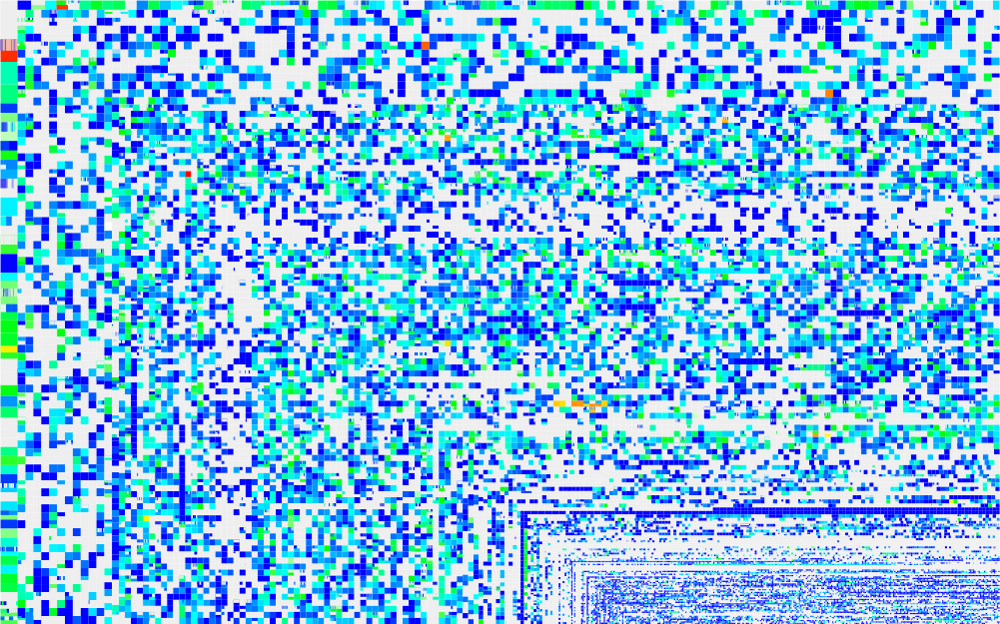

# What is zesplot?

Zesplot is an attempt at visualising IPv6 addresses and their prefixes. It is
based on squarified treemaps, producing space-filling plots with relative
sizing. Colouring can be based on the number of addresses in a prefix, or, when
used in combination with zmap output, metrics like the median TTL observed in a
prefix.

The idea for zesplot was born after attending the
[RIPE IPv6 Hackathon](https://labs.ripe.net/Members/becha/results-hackathon-version-6) 
and a first version was presented in [MAPRG](https://datatracker.ietf.org/meeting/101/materials/slides-101-maprg-zesplot-an-attempt-to-visualise-ipv6-address-space-00) at IETF101 in London.

Most of the current features were implemented for our IMC'18 paper titled
['Clusters in the Expanse: Understanding and Unbiasing IPv6 Hitlists'](https://ipv6hitlist.github.io).


## Compiling

Zesplot is implemented in Rust so we can leverage `cargo` to build it. Consider
using rustup ( https://rustup.rs/ ) if you are new to Rust. ~~We need to use
nightly in order to leverage the 128 bit integer features not yet in the stable
channel. Using rustup, run `rustup override set nightly` from within the cloned
repository. Check using `rustc -V` whether you are now indeed using nightly.~~
As the 128 bit integer support is now stabilized, we do not need rust nightly
anymore.

Once you have Rust up and running, and cloned this repository, use either

	cargo build

or

	cargo build --release

to compile zesplot. The resulting binaries will be respectively
`target/debug/zesplot` and `target/release/zesplot`.

## Using zesplot

The (possibly outdated) `ipv6_prefixes.txt` containing announced v6 prefixes
(created from RouteViews data) can be passed using `--prefixes`. The
`address-file` passed must be a list of addresses, one-per-line.

The prefix and address lists are mandatory arguments. Other options are listed
below.

After running, the resulting SVG file is written to `html/image.svg`, and it is
inlined in `html/index.html`.


## Example output





```

$ zesmap -h

USAGE:
    zesplot [FLAGS] [OPTIONS] --addresses <address-file> --colour-input <colour-input> --prefixes <prefix-file>

FLAGS:
        --create-addresses    Create file containing addresses based on hits from address-file, and exit
        --html                Create HTML wrapper output in ./html
        --create-prefixes     Create file containing prefixes based on hits from address-file, and exit
    -f, --filter              Filter out empty prefixes, only plotting prefixes containing addresses from the
                              --addressess
    -h, --help                Prints help information
        --no-labels           Omit the text labels in the final plot
    -u, --unsized             Do not size the rectangles based on prefix length, but size them all equally
    -V, --version             Prints version information

OPTIONS:
    -a, --addresses <address-file>                       IPv6 addresses to plot on map
        --asn-colours <asn-colours>
            Additional colours for ASNs. File should contain lines, formatted '$ASN $ID'.
                                            Every unique ID will be assigned a colour on the scale.
    -c, --colour-input <colour-input>
            Base the colours on one of the following:
                                            "hits" (default)
                                            "hw" (average hamming weight in prefix)
                                            "mss" (average TCP MSS in prefix)
                                            "ttl" (average TTL of responses in prefix, only when using ZMAP input)
        --dp-function <dp-function>
            Base the colour on a function on the datapoints (for TTL or MSS) within a prefix:
                                            "avg" mean of the values
                                            "median" median of the values
                                            "var" variance of the values
                                            "uniq" number of unique values
        --filter-threshold <filter-threshold>            Set minimum threshold for --filter. Default 1.
        --filter-threshold-asn <filter-threshold-asn>
            Set minimum threshold for --filter for hits per ASN instead of per prefix. Default 1.

        --legend-label <legend-label>                    Set a custom label for the legend
        --output-fn <output-fn>
            Override the generated output filenames. File extensions (.svg, .html) will be appended.

    -l, --limit <plot-limit>                             Limits number of areas plotted. 0 for unlimited. Default 2000
    -p, --prefixes <prefix-file>                         Prefixes to map
        --scale-max <scale-max>                          Overrule maximum of colour scale, only for -c hits
```
